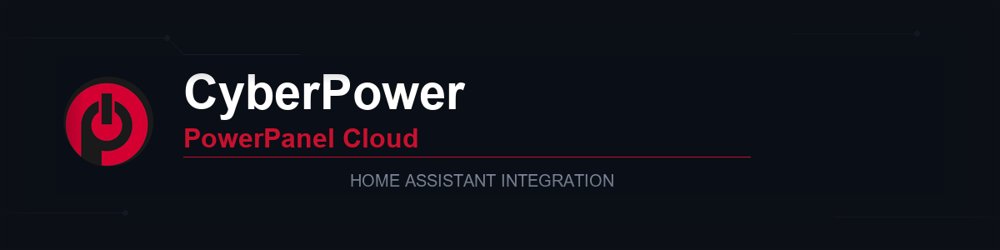
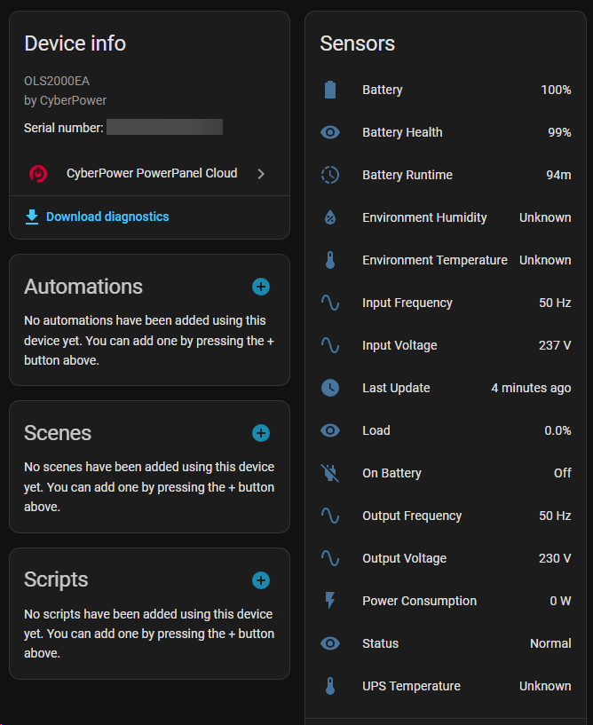

# CyberPower PowerPanel Cloud

[](https://github.com/hacs/integration)
[](LICENSE)
[](https://www.home-assistant.io/)
[](https://sonarcloud.io/summary/new_code?id=Csontikka_ha-cyberpower-cloud)
[](https://sonarcloud.io/summary/new_code?id=Csontikka_ha-cyberpower-cloud)
[](https://sonarcloud.io/summary/new_code?id=Csontikka_ha-cyberpower-cloud)



Home Assistant custom integration for **CyberPower UPS** devices connected via [PowerPanel Cloud](https://powerpanel.cyberpower.com).

Monitor battery status, power consumption, load, voltage, temperature and more — directly from your Home Assistant dashboard. Get instant notifications on power outages through dedicated events.

## Prerequisites

1. A CyberPower UPS registered in [PowerPanel Cloud](https://powerpanel.cyberpower.com)
2. **Two-factor authentication must be DISABLED** on the PowerPanel Cloud account:
   - Open the PowerPanel Cloud mobile app
   - Go to **Account** → **Security**
   - Turn off **Two-Factor Authentication**
   - The integration uses the mobile app's login flow, which does not support 2FA — login will fail otherwise
3. **Temperature unit must be set to Celsius** in the PowerPanel Cloud app:
   - Open the PowerPanel Cloud mobile app
   - Go to **Account** → **Settings**
   - Set **Temperature Unit** to **°C (Celsius)**
   - The API returns raw values without unit indicators — this integration assumes Celsius

## Supported devices

Works with any CyberPower UPS registered in PowerPanel Cloud, including models with:

- **RWCCARD100** cloud network card
- **RWCCARD200** cloud network card
- Built-in cloud connectivity

Tested with:

| Model | Cloud Card | Status |
|-------|-----------|--------|
| OLS2000EA | RWCCARD100 | Fully working |

> If you have a different model working, please open an issue so we can add it to the list.

## Features

### Sensors

| Sensor | Unit | Description |
|--------|------|-------------|
| Battery | % | Battery charge level |
| Battery Runtime | min | Estimated remaining runtime on battery |
| Battery Health (BHI) | % | Battery health indicator |
| Power Consumption | W | Real-time power draw (Energy Dashboard compatible) |
| Load | % | Load percentage (calculated from watts / rated power) |
| Input Voltage | V | Utility input voltage |
| Output Voltage | V | UPS output voltage |
| Input Frequency | Hz | Utility input frequency |
| Output Frequency | Hz | UPS output frequency |
| UPS Temperature | °C | Internal UPS temperature |
| Environment Temperature | °C | External sensor temperature |
| Environment Humidity | % | External sensor humidity |
| Status | — | Device status (Normal / Warning / Critical / Offline) |
| Last Update | timestamp | Last successful API data update |

> Temperature and humidity sensors require a compatible environmental sensor connected to the UPS. They will show as "Unknown" if not available.

### Binary sensors

| Sensor | Description |
|--------|-------------|
| On Battery | `on` when UPS is running on battery (power outage) |

### Configuration entities

| Entity | Type | Description |
|--------|------|-------------|
| UPS Rated Power | number | Per-device rated power in watts — used to calculate Load % |

> Set the rated power to your UPS model's **watt** rating (not VA). For example, OLS2000EA = 1800W. If not configured, Load % will show as "Unknown" until you set it.

### Power outage events

The integration fires Home Assistant events when the power state changes — faster than polling the binary sensor:

| Event | Fired when |
|-------|------------|
| `cyberpower_cloud_power_outage_started` | UPS switches to battery (power outage detected) |
| `cyberpower_cloud_power_outage_ended` | UPS returns to mains power |

Event data:

```json
{
  "device_sn": "...",
  "device_name": "...",
  "device_model": "..."
}
```

### Other features

- **Multiple UPS support** — one account can monitor multiple devices
- **Energy Dashboard** — Power Consumption sensor is compatible with HA Energy Dashboard
- **Auto re-authentication** — automatic token refresh on expiry
- **Configurable polling** — update interval from 60 to 3600 seconds (default: 300)
- **Error resilience** — stops polling after 3 consecutive failures to avoid account lockout, creates repair issues
- **Diagnostics** — built-in diagnostics export for troubleshooting (sensitive data redacted)
- **Firmware version** — displayed in device info when reported by the API

## Installation

### HACS (recommended)

1. Open **HACS** in Home Assistant
2. Go to **Integrations** > click the three-dot menu (top right) > **Custom repositories**
3. Add repository URL: `https://github.com/Csontikka/ha-cyberpower-cloud`
4. Select category: **Integration**
5. Click **Add**
6. Search for **"CyberPower PowerPanel Cloud"** and click **Download**
7. **Restart Home Assistant**

### Manual installation

1. Download the latest release from [GitHub](https://github.com/Csontikka/ha-cyberpower-cloud/releases)
2. Copy the `custom_components/cyberpower_cloud` folder to your Home Assistant `config/custom_components/` directory
3. Restart Home Assistant

## Setup

1. Go to **Settings** > **Devices & Services** > **Add Integration**
2. Search for **"CyberPower PowerPanel Cloud"**
3. Enter your PowerPanel Cloud email and password
4. The integration will discover all UPS devices on your account

<!-- [SCREENSHOT: config flow - login screen] -->

After setup:

1. Open the device page for your UPS
2. Set the **UPS Rated Power** (watts) in the Configuration section — this is required for the Load % sensor to work correctly



## Configuration

### Options

Click **Configure** on the integration card to adjust:

| Option | Range | Default | Description |
|--------|-------|---------|-------------|
| Update interval | 60–3600 s | 300 s | How often to poll the CyberPower Cloud API |

### Per-device settings

Each UPS device has its own configurable **UPS Rated Power** (watts) on the device page. This value is used to calculate the Load % sensor.

Common rated power values:

| Model | VA | Watts |
|-------|-----|-------|
| OLS1000EA | 1000 | 900 |
| OLS1500EA | 1500 | 1350 |
| OLS2000EA | 2000 | 1800 |
| OLS3000EA | 3000 | 2700 |

> Check your UPS model's datasheet for the exact watt rating. VA and watts are **not** the same.

## Energy Dashboard

The **Power Consumption** sensor can be added to the Home Assistant Energy Dashboard:

1. Go to **Settings** > **Dashboards** > **Energy**
2. Under **Individual devices**, click **Add device**
3. Select your UPS Power Consumption sensor

<!-- [SCREENSHOT: Energy Dashboard with UPS power consumption] -->

## Automation examples

### Power outage notification

```yaml
automation:
  - alias: "Power outage alert"
    trigger:
      - platform: event
        event_type: cyberpower_cloud_power_outage_started
    action:
      - service: notify.mobile_app
        data:
          title: "Power Outage!"
          message: "UPS {{ trigger.event.data.device_name }} is running on battery"
```

### Power restored notification

```yaml
automation:
  - alias: "Power restored"
    trigger:
      - platform: event
        event_type: cyberpower_cloud_power_outage_ended
    action:
      - service: notify.mobile_app
        data:
          title: "Power Restored"
          message: "UPS {{ trigger.event.data.device_name }} is back on mains power"
```

### Low battery warning

```yaml
automation:
  - alias: "UPS low battery warning"
    trigger:
      - platform: numeric_state
        entity_id: sensor.my_ups_battery
        below: 30
    action:
      - service: notify.mobile_app
        data:
          title: "UPS Battery Low"
          message: "Battery at {{ states('sensor.my_ups_battery') }}% — {{ states('sensor.my_ups_battery_runtime') }} minutes remaining"
```

## Error handling

| Situation | Behavior |
|-----------|----------|
| No internet at startup | Integration retries automatically (ConfigEntryNotReady) |
| Invalid credentials | Stops polling, creates a repair issue, prompts for re-authentication |
| API errors (3 consecutive) | Stops polling, creates a repair issue |
| Token expiry | Automatic re-login and retry |

## Debug logging

Add the following to your `configuration.yaml` to enable debug logging:

```yaml
logger:
  default: info
  logs:
    custom_components.cyberpower_cloud: debug
```

After restarting, check **Settings** > **System** > **Logs** for detailed API communication logs.

## How it works

This integration uses the internal CyberPower PowerPanel Cloud API (`iotapi.cyberpower.com`) — the same API used by the official PowerPanel Cloud mobile app. There is no official public API; this integration was built through reverse engineering.

Data is polled at a configurable interval (default: 5 minutes). Two API endpoints are used per update cycle:

- `/device/read/status` — battery status, load (watts), BHI
- `/status/log` — voltage, frequency, temperature readings

## Known limitations

- **Cloud-only** — requires an active internet connection; does not work with local/USB-connected UPS
- **Polling-based** — not real-time; the minimum interval is 60 seconds
- **No UPS control** — read-only monitoring; cannot shutdown, test, or configure the UPS
- **Temperature sensors** — only available with compatible environmental sensors (e.g., EMHD1)

## License

[MIT](LICENSE)
